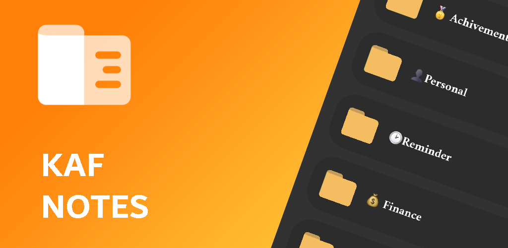
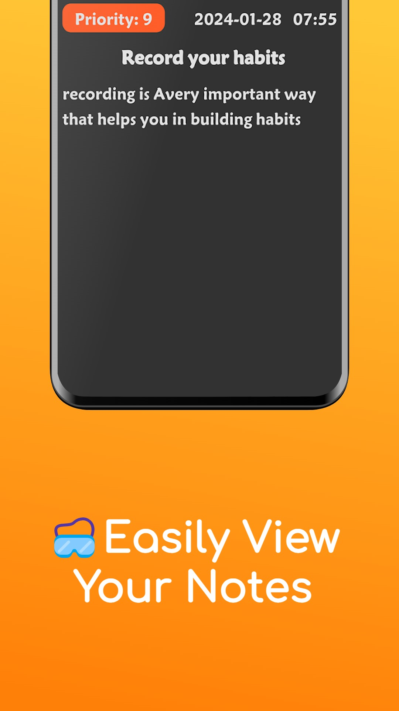
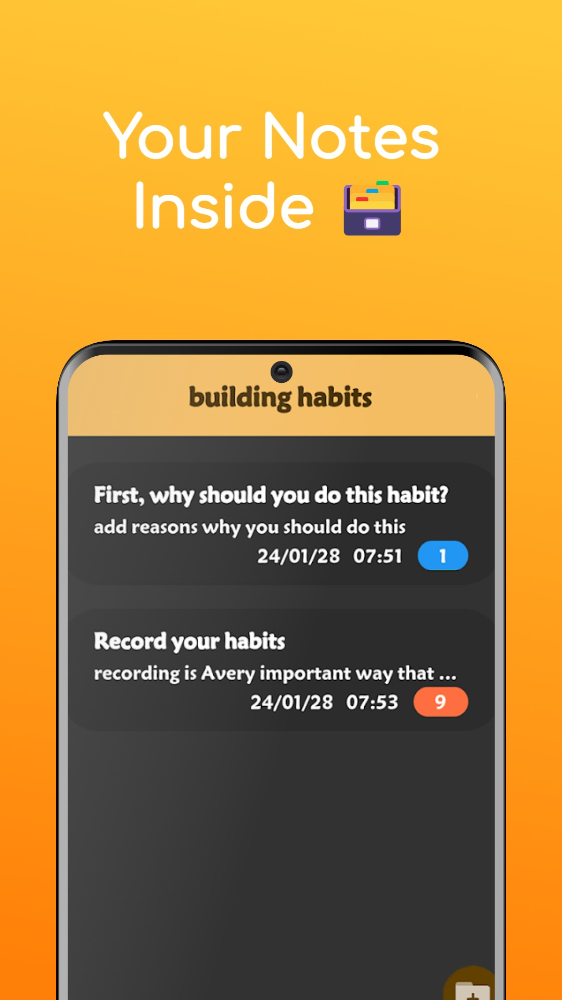
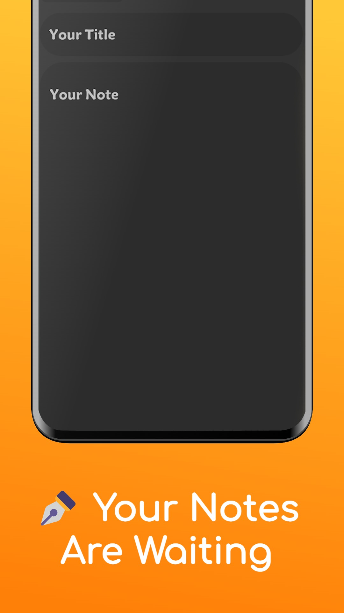
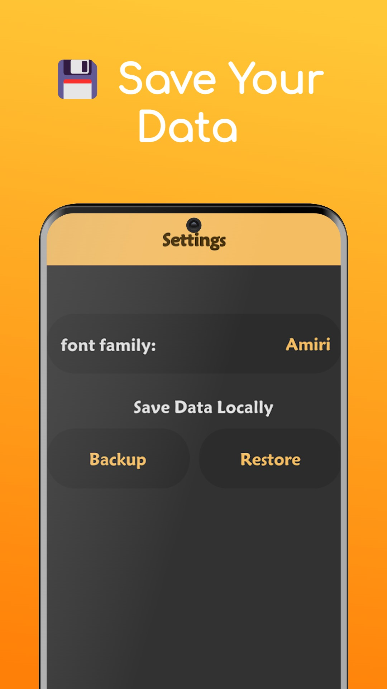

# KAF

[</img>](https://play.google.com/store/apps/details?id=hesham.hcody.NoteAndFolder)

|   |   |   |   |
|---|---|---|---|
|  |  |  |  |

Welcome to KAF, your reliable companion for efficient note-taking,
seamless organization, and hassle-free categorization.
This app is committed to empowering you with a clutter-free
and intuitive platform to capture your thoughts, ideas, and important information.
## Key Features:

TFolders and Categorized Notes:** Stay organized with the ability to create folders and categorize your notes. Group related content together, making it effortless to find what you need when you need it.

✒️ **User-Friendly Note Editor:** Our user-friendly note editor lets you focus on your content without distractions. Customize your notes with fonts, styles, and formatting that suit your preferences.

🎨 **Dynamic Mode:** Enjoy with the support of android 12+ dynamic palate.

🌎 **Multi Language Support:** now it supports Arabic and English languages

🔥 **Priority Notes Page:** you can find your important notes quickly

🎲 **Random Notes Page:** you can see your notes in a different way

**Future Features**:
🔍 **Quick Search:** Locate specific notes or folders in an instant with our efficient search feature. No more sifting through endless pages – find what you need effortlessly.
 

Your feedback and contributions are invaluable in shaping the future of the app.

## 🔓 Open Source and Ad-Free:

We believe in transparency and providing a seamless user experience. That's why KAF is proudly open source and completely ad-free. No distractions, no invasive ads – just a clean and distraction-free environment to enhance your productivity.

Whether you're a student, professional, creative thinker, or simply someone who loves to jot down ideas on the go, KAF is designed to meet your needs. Experience the freedom of organized note-taking without the clutter. Download KAF today and join us in revolutionizing the way you capture and manage your notes.
